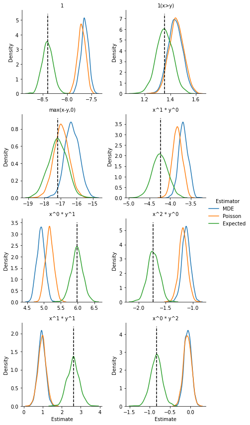

matching_separable_simuls
================

<!-- WARNING: THIS FILE WAS AUTOGENERATED! DO NOT EDIT! -->

## Install

``` sh
pip install matching_separable_simuls
```

## summary

The package reads the marriage patterns from the Choo and Siow 2006
*Journal of Political Economy* paper for the non-reform states of the
1970 wave. It fits a parsimonious homoskedastic logit model. Then it
generates `S` datasets from the fitted model, and it uses them to test
the estimation methods presented in Galichon-Salanié 2022.

## setting the options

``` python
do_simuls = False
plot_simuls = True
```

## reading the data


    The data has 25 types of men and 25 types of women.

We reshape the variance-covariance matrix and we normalize the data to a
unit total mass of households.

``` python
# the number of household observations
n_households_obs = 75_265

mus = Matching(muxy, nx, my)
mus_norm = rescale_mus(mus, n_households_obs)

varmus_norm = reshape_varcov(varmus, mus, n_households_obs)
```

Finally, we add a small number to zero cells:

``` python
mus_norm_fixed = remove_zero_cells(mus_norm) 
muxy_norm_fixed, mux0_norm_fixed, mu0y_norm_fixed, nx_norm_fixed, my_norm_fixed = mus_norm_fixed.unpack()
```

## fitting a basic model

First we need to generate some basis functions. First we
quantile-transform the margins; then we generate orthogonal polynomials
on `[0,1]`. We also create variables `1(x=y)` and `max(x-y, 0)`.

``` python
degrees = [(1,0), (0,1), (2,0), (1,1), (0,2)]
base_functions, base_names = generate_bases(nx_norm_fixed, my_norm_fixed, degrees)
n_bases = base_functions.shape[-1]
print(f"We created {n_bases} bases")
```

    We created 8 bases

### we save the data and the bases we generated

``` python
with open(data_dir / "mus_norm_fixed.pkl", "wb") as f:
    pickle.dump(mus_norm_fixed, f)
with open(data_dir / "varmus_norm.pkl", "wb") as f:
    pickle.dump(varmus_norm, f)
with open(data_dir / "base_functions.pkl", "wb") as f:
    pickle.dump(base_functions, f)
```

### testing the estimation

``` python
mde_results = estimate_semilinear_mde(
            mus_norm_fixed, base_functions, entropy_choo_siow, 
            more_params=None
        )

estim_Phi = mde_results.estimated_Phi
estim_coeffs = mde_results.estimated_coefficients
std_coeffs = mde_results.stderrs_coefficients

print(mde_results)
```

    ********************************************************************************
    The data has 75264.99823524455 households

    The model has 25x25 margins
          The entropy is parameter-free. 
    We use 8 basis functions.

    The estimated coefficients (and their standard errors) are

       base 1:     -8.407 ( 0.114)
       base 2:      1.356 ( 0.064)
       base 3:    -17.191 ( 0.576)
       base 4:     -4.236 ( 0.188)
       base 5:      5.984 ( 0.166)
       base 6:     -1.731 ( 0.112)
       base 7:      2.621 ( 0.306)
       base 8:     -0.838 ( 0.140)

    Specification test:
       the value of the test statistic is   2168.446
         for a chi2(617), the p-value is      0.000
    ********************************************************************************

## generating artificial datasets and fitting a homoskedastic logit model

``` python
choo_siow_estim = ChooSiowPrimitives(estim_Phi, nx_norm_fixed, my_norm_fixed)

n_households_sim=n_households_obs
n_sim = 1_000

# generate random seeds
seeds = [None]*n_sim
random.seed(130962)
for i_sim in range(n_sim):
    seeds[i_sim] = random.randrange(100_000)

estim_coeffs_mde = np.zeros((n_sim, estim_coeffs.size))
estim_coeffs_poisson = np.zeros((n_sim, estim_coeffs.size))

def _run_simul(i_sim, seed, n_households_sim, base_functions, entropy_choo_siow):
    mus_sim = choo_siow_estim.simulate(n_households_sim)
    mus_sim_non0 = remove_zero_cells(mus_sim)
    mde_results_sim = estimate_semilinear_mde(
        mus_sim_non0, base_functions, entropy_choo_siow, more_params=None)
    estim_coeffs_mde = mde_results_sim.estimated_coefficients
    poisson_results_sim = choo_siow_poisson_glm(mus_sim_non0, base_functions, verbose = 0)
    estim_coeffs_poisson = poisson_results_sim.estimated_beta
    print(f"Done simul {i_sim}")
    return estim_coeffs_mde, estim_coeffs_poisson
```

``` python
if do_simuls:
    list_args = [[i_sim, seeds[i_sim], n_households_sim, base_functions, entropy_choo_siow]
                for i_sim in range(n_sim)]

    nb_cpus = 8

    with Pool(nb_cpus) as pool:
        results = pool.starmap(_run_simul, list_args)

    for i_sim in range(n_sim):
        estim_coeffs_mde[i_sim, :] = results[i_sim][0]
        estim_coeffs_poisson[i_sim, :] = results[i_sim][1]

    simul_results = {'Base names': base_names, 'True coeffs': estim_coeffs, 'MDE stderrs': std_coeffs, 
                     'MDE': estim_coeffs_mde, 'Poisson': estim_coeffs_poisson}

    with open(data_dir / f"choosiow_{n_households_sim}.pkl", "wb") as f:
        pickle.dump(simul_results, f)
```

### we plot the distribution of the estimate

``` python
if plot_simuls:
    plot_simulation_results("choosiow", n_households_sim)
```

    We have a total of 0 outliers for MDE,  out of 1000 simulations.
    We have a total of 1 outliers for Poisson,  out of 1000 simulations.
    We are discarding 1 outlier samples



## fitting a nested logit model
